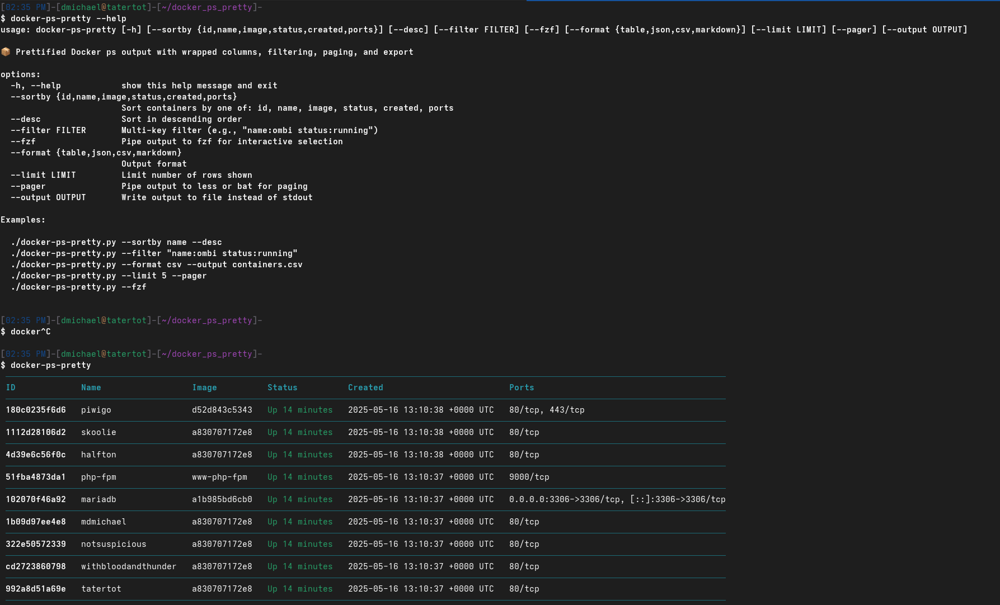

Dunno if anyone else is annoyed by this as me.. but I hate that when I run `docker ps`, ports are wrapped just to the next line and not contained within the column. I also just wanted some simple sort options as well

### Pop-os etc install instructions
```bash
pip install rich
chmod +x docker-ps-pretty.py
./docker-ps-pretty.py
```
or
```bash
python3 docker-ps-pretty.py
```

### Ubuntu install instructions
or if you're on ubuntu or something that enforces PEP 668, turned it into a pipx compatible package

```bash
sudo apt install pipx
pipx ensurepath
pipx runpip rich-cli install rich
cd Docker-PS-Pretty && pipx install .
```

shout out to chatgpt for vibe coding this for me

I'm also just aliasing it as `alias dps="python3 ~/docker-ps-pretty.py"`
or if you just want to copy and paste

```bash
echo 'alias dps="python3 ~/docker-ps-pretty.py"' >> ~/.bashrc && source ~/.bashrc
```

### dpsp in action
